# Basic Kubernetes Tests with PKS

When creating a new PKS cluster, there needs to be a starting point. How do you verify everything is working as it should? This set of instructions I built for myself as a means of:

1. Making steps to use basic Kubernetes functionality easily accessible
2. Use these steps for demos

## Create and Access
### Creating and Viewing Available Clusters
Creating a new cluster is very easy. It's easily done using a singular command and it can be configured for the size you need. The DNS or IP endpoint, denoted by `-e` flag, needs from a routable pool of addresses that are defined during PKS instantiation. It will be the endpoint API for the cluster.

The option to specify the number of worker nodes uses the `-n` flag.
```
pks create-cluster my-cluster -e DNSorIP
```

To see all the available clusters:
```
pks list-clusters
```

### Access the Cluster
The PKS cluster creates a token based authentication and the `./kube/config` file will hold the credentials. To create the `./kube/config` file as well as set the cluster context:
```
pks get-credentials my-cluster
```

This is the config that can be given to anyone to access the cluster
```
cat $HOME/.kube/config
```

## Storage
### StorageClass
A StorageClass provides a way for administrators to describe the “classes” of storage they offer. Different classes might map to quality-of-service levels, or to backup policies, or to arbitrary policies determined by the cluster administrators. Kubernetes itself is unopinionated about what classes represent. This concept is sometimes called “profiles” in other storage systems. Read more about [vSphere StorageClass](https://kubernetes.io/docs/concepts/storage/storage-classes/#vsphere) available parameters.

The following is a basic StorageClass that will use the default datastore specified in the vSphere config using Thin Provisioning. It's called `thin-disk`.

```
kubectl apply -f https://raw.githubusercontent.com/kacole2/pks-k8s-tests/master/pks-sc.yml
```

### PersistentVolumeClaim
A PersistentVolumeClaim is nothing more than a request for a PersistentVolume. The PVC can then be used by Deployments, ReplicaSets, etc. A claim must specify the access mode and storage capacity, once a claim is created PV is automatically bound to this claim

The following will create a 8Gi volume from the StorageClass that was used previously. It will be called `thin-claim`
```
kubectl apply -f https://raw.githubusercontent.com/kacole2/pks-k8s-tests/master/pks-pvc.yml
```

### Use the Claim
This Deployment will create a Postgres container and attach the volume claim to it.

```
kubectl apply -f https://raw.githubusercontent.com/kacole2/pks-k8s-tests/master/pks-postgres-deploy.yml
```

# Network
## Namespace Creation
Kubernetes supports multiple virtual clusters backed by the same physical cluster. These virtual clusters are called namespaces. When a new namespace has been created with PKS, there is a new NSX-T network created with it's own IP space from a pool that has been allocated.
```
kubectl create namespace myapps
```
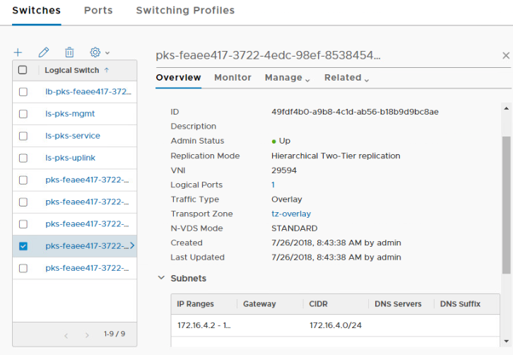

Set kubectl commands to use it for any deployment
```
kubectl config set-context my-cluster --namespace myapps
```

## Testing Network Policies
NetworkPolicy primitives allow the use of microsegmentation. Meaning it's possible to create firewall rules between pods of the namespace or between namespaces. To test this, we first need two pods to test it's connectivity. This example will create two Deployments, each using a standard NGINX webserver. The are given unique labels `webfront` and `db` to simulate a standard app, but they will be talking over port 80.

```
kubectl apply -f https://raw.githubusercontent.com/kacole2/pks-k8s-tests/master/pks-nettest-nginx.yml
```

Using the NSX-T UI, we can verify communication is successful between the pods using the Traceflow tool. Select the individual pods by doing `app1` to `app2` traffic flow, set the port for communication to 80/TCP and click test. There will be green checkmarks
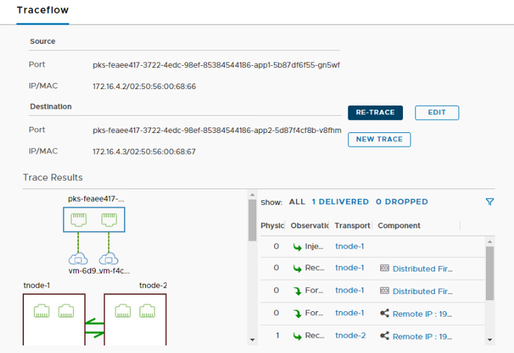

Introducing a NetworkPolicy is like firewall ruleset. Let's implement a catch-all policy that denies all Ingress traffic on the namespace `myapps`.
```
kubectl apply -f https://raw.githubusercontent.com/kacole2/pks-k8s-tests/master/pks-nettest-deny.yml
```
Do the same Traceflow (by hitting `RE-TRACE`) as before and notice traffic is being blocked.
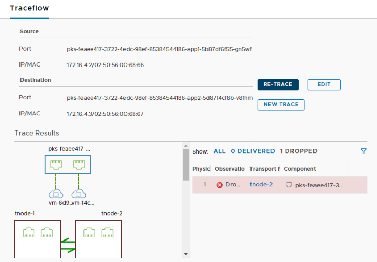


The following will allow communications on port 80 from any pods that have the label `webfront` going to the label `db`.
```
kubectl apply -f https://raw.githubusercontent.com/kacole2/pks-k8s-tests/master/pks-nettest-np.yml
```

Do the same Traceflow (by hitting `RE-TRACE`) as before and notice traffic is being allowed now. This is micro-segmentation within an existing namespace.
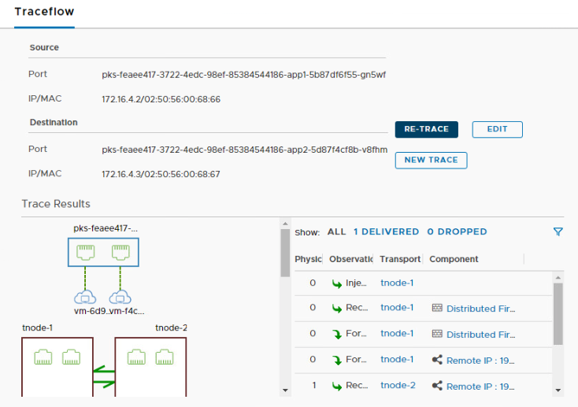

## Clean Up
To keep things simple, remove the network policies so it's a clean slate.
```
kubectl delete networkpolicy default-deny-myapps
kubectl delete networkpolicy nsx-demo-policy
```

## Load Balancer
One of the unique features of NSX-T is the ability to create Kubernetes LoadBalancer primitives. This is a service that will match a type of selector and LoadBalance across. The IPs available to LoadBalancers are given to NSX-T during configuration.

Scale up the webfront
```
kubectl scale deployment app1 --replicas 4
```
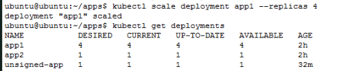

Create the load balancer
```
kubectl apply -f https://raw.githubusercontent.com/kacole2/pks-k8s-tests/master/pks-nettest-lb.yml
```

Get the LoadBalancer IP
```
kubectl get services
```
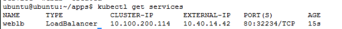

Access the LoadBalancer IP from the external IP.
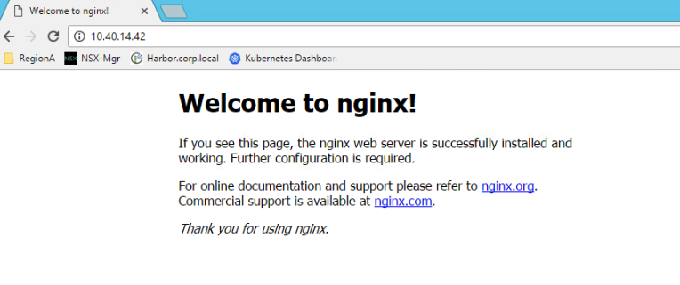

# Harbor
[Project Harbor](https://github.com/vmware/harbor) is an an open source trusted cloud native registry project that stores, signs, and scans content. Harbor extends the open source Docker Distribution by adding the functionalities usually required by users such as security, identity and management. Having a registry closer to the build and run environment can improve the image transfer efficiency. Harbor supports replication of images between registries, and also offers advanced security features such as user management, access control and activity auditing.

## Create a New Project
To get started create a new Project within the GUI (make it publicly accessible) called `myimages`. Click on Configuration to enable content trust and CVE scanning.
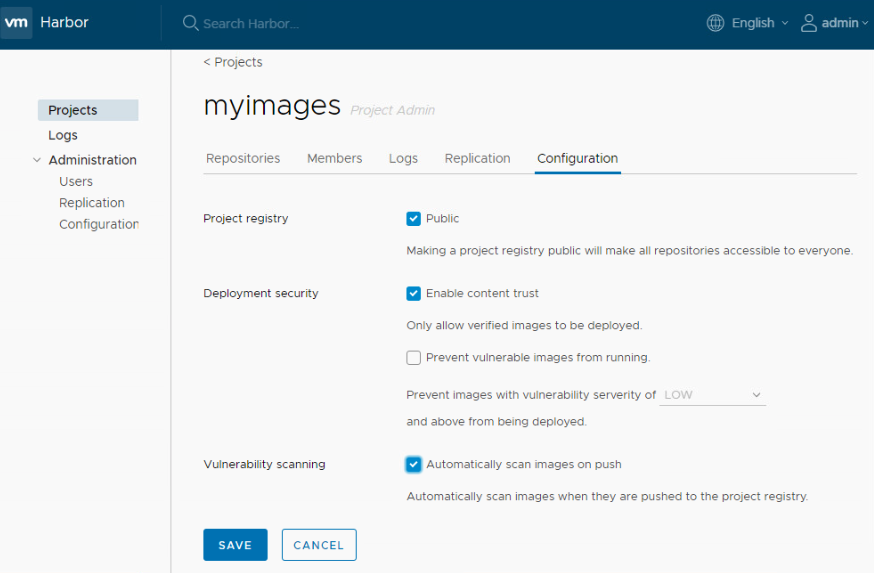

## Push an Unsigned Image
Since nginx is aleady downloaded, use that as our demo app. Create a new tag for it and push this new image to Harbor.
```
docker tag nginx:latest harbor.corp.local/myimages/nginx:V1
docker push harbor.corp.local/myimages/nginx:V1
```

Within the UI, look at the image to verify it is unsigned.
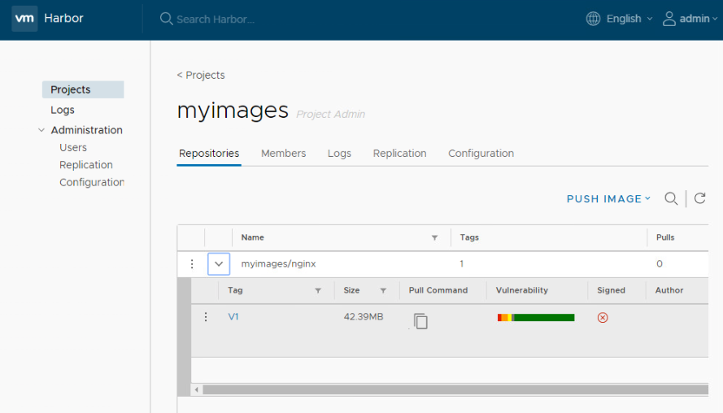

## Deploy an Unsigned Image
Let's find out what happens when an unsigned image is deployed
```
kubectl apply -f https://raw.githubusercontent.com/kacole2/pks-k8s-tests/master/pks-nginx-harbor.yml
```

Describe the individual pod and there is an error saying the image is not signed in notary.
```
kubectl get pods
kubectl describe pod <thatpod>
```
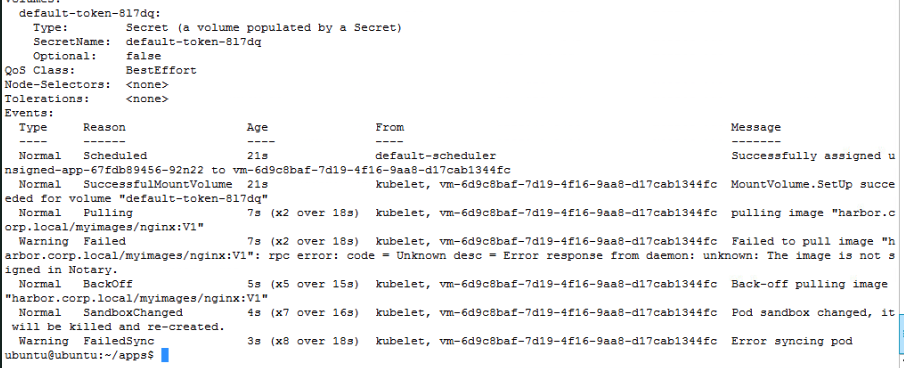

## Enable Content Trust and Repush
Enable content trust and push
```
export DOCKER_CONTENT_TRUST_SERVER=https://harbor.corp.local:4443
export DOCKER_CONTENT_TRUST=1
docker push harbor.corp.local/myimages/nginx:V1
```
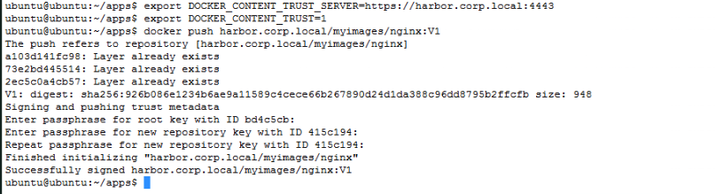

Refresh the UI and see the green checkmark.
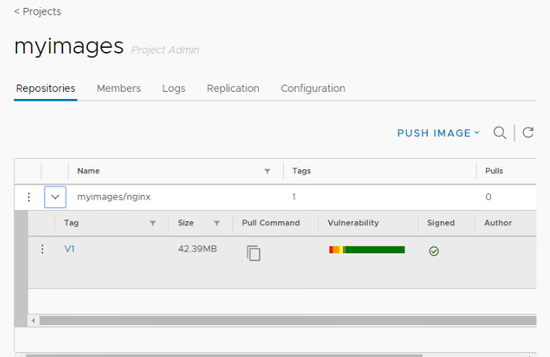

## Redeploy the App
Redeploy the app and it will work
```
kubectl delete deployment nginx-harbor
kubectl apply -f https://raw.githubusercontent.com/kacole2/pks-k8s-tests/master/pks-nginx-harbor.yml
```

# LICENSE
Licensed under the Apache License, Version 2.0 (the “License”); you may not use this file except in compliance with the License. You may obtain a copy of the License at http://www.apache.org/licenses/LICENSE-2.0

Unless required by applicable law or agreed to in writing, software distributed under the License is distributed on an “AS IS” BASIS, WITHOUT WARRANTIES OR CONDITIONS OF ANY KIND, either express or implied. See the License for the specific language governing permissions and limitations under the License.
